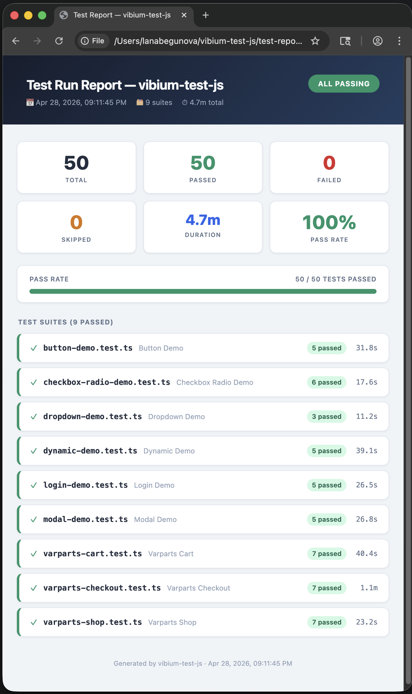

# vibium-test-js

A test framework built on the [Vibium](https://github.com/VibiumDev/vibium) JS browser automation client. Provides isolated browser fixtures, custom matchers, failure artifacts, and sync/async test APIs — compatible with both Vitest and Jest.

## Features

- **Isolated contexts** — each test gets a fresh `BrowserContext` (separate cookies, storage, session)
- **One browser per worker** — browser starts once per Vitest/Jest worker, contexts are cheap
- **Custom matchers** — `toBeVisible`, `toHaveText`, `toHaveURL`, and more
- **Failure artifacts** — screenshots and session recordings saved automatically on failure
- **Sync API** — blocking `test.sync()` for environments where async isn't viable
- **Test-level retries** — retries on `BrowserCrashedError` / `ConnectionError` only (max 2)
- **Auth reuse** — pre-load storage state via `storageState` config option

## Apps under test

### [testtrack.org](https://testtrack.org) — 29 tests

A browser automation training facility with 15 interactive modules.

| File | Tests | Covers |
|---|---|---|
| `button-demo.test.ts` | 5 | Counter increments, activated state, disabled button, reset |
| `login-demo.test.ts` | 5 | Valid auth → AUTHENTICATED, invalid → ACCESS DENIED, demo credentials, reset |
| `dropdown-demo.test.ts` | 3 | Native select value, option switching, reset to default |
| `modal-demo.test.ts` | 5 | Dialog open/close (two paths), interaction counter, form modal |
| `checkbox-radio-demo.test.ts` | 6 | Toggle, double-toggle, radio exclusivity, independent checkboxes |
| `dynamic-demo.test.ts` | 5 | Placeholder state, async archive load, monitoring start/stop, threat analysis |

### [var.parts](https://var.parts) — 21 tests

A test e-commerce storefront for Vibium Automation Robot parts.

| File | Tests | Covers |
|---|---|---|
| `varparts-shop.test.ts` | 7 | Product grid (12 items), card content, product detail page, nav, about/FAQ |
| `varparts-cart.test.ts` | 7 | Empty cart, add-to-cart toast, nav badge, cart contents, subtotal, clear, multi-item |
| `varparts-checkout.test.ts` | 7 | Delivery form, shipping options, order summary, payment page, order confirmation |

> **Note:** var.parts cart is React state (not server-persisted). Tests navigate via SPA links after adding items — direct `page.go('/cart')` loses cart state.

### [the-internet.herokuapp.com/shadowdom](https://the-internet.herokuapp.com/shadowdom) — 8 tests

A live shadow DOM demo with two `<my-paragraph>` custom elements using open shadow roots and slot-based content projection.

| File | Tests | Covers |
|---|---|---|
| `shadow-dom.test.ts` | 8 | Shadow host count, open mode, default text, scoped styles, slot projection (span + list), CSS encapsulation, shared structure |

> **Note:** vibium CSS selectors do not pierce shadow roots. All shadow DOM access uses `page.evaluate()` with `element.shadowRoot`. Nested arrays from evaluate must be round-tripped through `JSON.stringify` / `JSON.parse` to avoid BiDi typed-value wrapping.

## Installation

```sh
npm install vibium-test-js vibium
```

## Quick start

### Vitest

```ts
// vitest.config.ts
import { defineConfig } from 'vitest/config';

export default defineConfig({
  test: {
    globals: true,
    setupFiles: ['vibium-test-js/vitest.setup'],
    testTimeout: 60_000,
    pool: 'forks',
  },
});
```

```ts
// vibium.config.ts
import { defineConfig } from 'vibium-test-js';

export default defineConfig({
  baseURL: 'https://example.com',
  headless: true,
  screenshotOnFailure: true,
});
```

```ts
// login.test.ts
import { test } from 'vibium-test-js';
import { expect } from 'vitest';

test('successful login navigates to dashboard', async ({ page }) => {
  await page.go('/login');
  await page.find({ label: 'Email' }).fill('user@example.com');
  await page.find({ label: 'Password' }).fill('secret');
  await page.find({ text: 'Sign in' }).click();
  await expect(page).toHaveURL('/dashboard');
});
```

### Jest

```ts
// jest.config.ts
export default {
  preset: 'ts-jest',
  setupFilesAfterFramework: ['vibium-test-js/jest.setup'],
  testTimeout: 60_000,
};
```

```ts
// login.test.ts
import { test } from 'vibium-test-js';
import { expect } from '@jest/globals';

test('successful login navigates to dashboard', async ({ page }) => {
  await page.go('/login');
  await page.find({ label: 'Email' }).fill('user@example.com');
  await page.find({ label: 'Password' }).fill('secret');
  await page.find({ text: 'Sign in' }).click();
  await expect(page).toHaveURL('/dashboard');
});
```

## Test fixtures

Each test function receives `{ browser, context, page }`:

| Fixture | Type | Description |
|---|---|---|
| `browser` | `Browser` | Shared browser instance for the worker |
| `context` | `BrowserContext` | Isolated context for this test |
| `page` | `Page` | Default page opened in the context |

```ts
test('example', async ({ page, context, browser }) => {
  // page is already navigated to baseURL if configured
});
```

## Configuration

`vibium.config.ts` (auto-discovered from `process.cwd()`):

| Option | Type | Default | Description |
|---|---|---|---|
| `baseURL` | `string` | — | URL navigated to before each test |
| `headless` | `boolean` | `true` | Run browser without a window |
| `timeout` | `number` | `30000` | Default element wait timeout (ms) |
| `retries` | `number` | `1` | Max retries on hard failures (capped at 2) |
| `screenshotOnFailure` | `boolean` | `true` | Save PNG to `test-results/failures/` |
| `recordOnFailure` | `boolean` | `false` | Save session recording ZIP to `test-results/recordings/` |
| `storageState` | `StorageState` | — | Pre-load cookies and storage (auth reuse) |

## Matchers

Register once in your setup file (`vitest.setup.ts` / `jest.setup.ts`), then use on any `Element` or `Page`:

| Matcher | Receives | Description |
|---|---|---|
| `toBeVisible()` | `Element` | Element is visible in the viewport |
| `toBeHidden()` | `Element` | Element is not visible |
| `toBeEnabled()` | `Element` | Element is interactable |
| `toBeDisabled()` | `Element` | Element is disabled |
| `toBeChecked()` | `Element` | Checkbox or radio is checked |
| `toHaveText(string \| RegExp)` | `Element` | Element's text contains or matches |
| `toHaveAttribute(name, value?)` | `Element` | Element has attribute, optionally with value |
| `toHaveURL(string \| RegExp)` | `Page` | Current URL contains or matches |
| `toHaveTitle(string \| RegExp)` | `Page` | Page title contains or matches |
| `toHaveCount(n)` | `Element[]` | Array has exactly n elements |

```ts
const btn = await page.find('#submit');
await expect(btn).toBeEnabled();
await expect(btn).toHaveText('Submit');

await expect(page).toHaveURL('/dashboard');

const items = await page.findAll('.item');
await expect(items).toHaveCount(3);
```

## Page Object pattern

```ts
import { test, PageObject } from 'vibium-test-js';
import type { Page } from 'vibium';

class LoginPage extends PageObject {
  emailInput = () => this.page.find({ label: 'Email' });
  passwordInput = () => this.page.find({ label: 'Password' });
  submitBtn = () => this.page.find({ text: 'Sign in' });
}

test('wrong password shows error', async ({ page }) => {
  const login = new LoginPage(page);
  await page.go('/login');
  await (await login.emailInput()).fill('user@example.com');
  await (await login.passwordInput()).fill('wrong');
  await (await login.submitBtn()).click();
  const err = await page.find({ role: 'alert' });
  await expect(err).toHaveText('Invalid credentials');
});
```

## Sync vs async

**Use `test()` (async) by default.** It works with Vitest `pool: 'forks'`, is compatible with Jest, and is what most browser test suites use.

**Use `test.sync()` only when** you need blocking calls — for example, integrating with a legacy codebase, a CLI script, or any context where `await` is not available.

| | `test()` | `test.sync()` |
|---|---|---|
| Syntax | `async/await` | synchronous (blocking) |
| Vitest pool | `forks` (default) | `threads` (required) |
| Jest | yes | yes |
| Vibium API | `Page`, `BrowserContext` | `PageSync`, `BrowserSync` |

`test.sync()` uses `Atomics.wait` under the hood, which blocks the thread. It cannot run in a forked process — set `pool: 'threads'` in your Vitest config when using it.

```ts
// vitest.config.ts — required for test.sync()
export default defineConfig({
  test: {
    pool: 'threads',
    setupFiles: ['vibium-test-js/vitest.setup'],
  },
});
```

```ts
import { test } from 'vibium-test-js';

test.sync('cart total updates after removal', ({ page }) => {
  page.go('/cart');
  page.find({ text: 'Remove Widget' }).click();
  const total = page.find('[data-testid=cart-total]').text();
  if (total.includes('Widget')) throw new Error(`Unexpected: ${total}`);
});
```

## Auth reuse

Save state once, restore it in all tests:

```ts
// auth.setup.ts (run once before the suite)
import { Browser } from 'vibium';

const browser = new Browser();
await browser.start({ headless: true });
const ctx = await browser.newContext();
const page = await ctx.newPage();
await page.go('https://example.com/login');
await page.find({ label: 'Email' }).fill('user@example.com');
await page.find({ label: 'Password' }).fill('secret');
await page.find({ text: 'Sign in' }).click();
await ctx.saveStorage('./auth.json');
await browser.stop();
```

```ts
// vibium.config.ts
import { defineConfig } from 'vibium-test-js';
import storageState from './auth.json';

export default defineConfig({
  baseURL: 'https://example.com',
  storageState,
});
```

## Failure artifacts

On test failure, artifacts are written automatically:

```
test-results/
  failures/   # PNG screenshots  (screenshotOnFailure: true)
  recordings/ # Session ZIP files (recordOnFailure: true)
```

## Running tests

**All tests**
```sh
npm test
```

**Specific file**
```sh
npx vitest run tests/varparts-cart.test.ts
```

**Files matching a pattern**
```sh
npx vitest run tests/varparts
npx vitest run tests/login
```

**One test by name** (substring match)
```sh
npx vitest run -t "cart is empty on initial visit"
npx vitest run -t "valid credentials"
```

**File + name combined**
```sh
npx vitest run tests/varparts-cart.test.ts -t "clear cart"
```

**Watch mode** (re-runs on file save)
```sh
npm run test:watch
npx vitest tests/varparts-cart.test.ts   # watch a single file
```

**Only marked tests** — add `test.only()` in the file, no extra flag needed:
```ts
test.only('run only this test', async ({ page }) => { ... });
```

## Test modifiers

```ts
test.only('run only this test', async ({ page }) => { ... });
test.skip('skip this test', async ({ page }) => { ... });
test.sync.only('sync only', ({ page }) => { ... });
test.sync.skip('sync skip', ({ page }) => { ... });
```

## Parallel execution

Parallelism is controlled by Vitest. The framework handles the rest: one browser per worker, one isolated `BrowserContext` per test.

```ts
// vitest.config.ts
export default defineConfig({
  test: {
    pool: 'forks',
    poolOptions: {
      forks: {
        maxForks: 4, // 4 browsers running concurrently
      },
    },
    setupFiles: ['vibium-test-js/vitest.setup'],
  },
});
```

- `maxForks: 1` — single browser, tests run serially (useful for debugging)
- `maxForks: 4` — safe default for most machines
- Don't exceed your CPU core count — each worker runs a real Chrome process

For `test.sync()`, use `pool: 'threads'` and `maxThreads` instead of `maxForks`.

## API coverage tests

`tests/api-*.test.ts` verify every public method in the vibium JS bindings. 12 categories, 128 tests total.

**Requires `VIBIUM_BIN_PATH`** — no local Go binary is built in this repo. Point to the global install:

```sh
export VIBIUM_BIN_PATH=/usr/local/lib/node_modules/vibium/node_modules/@vibium/darwin-x64/bin/vibium
```

Run all categories:

```sh
export VIBIUM_BIN_PATH=/usr/local/lib/node_modules/vibium/node_modules/@vibium/darwin-x64/bin/vibium && for f in api-navigation api-find api-element-actions api-element-read api-wait api-evaluate api-network api-events api-page-control api-browser-context api-input api-recording; do
  echo "=== $f ===" && npx vitest run tests/$f.test.ts --reporter=verbose 2>&1
done
```

**Confirmed baseline (two independent runs):** 125 pass / 3 bug / 0 fail

| Category | Total | Pass | Bug |
|---|---|---|---|
| navigation | 7 | 7 | 0 |
| find | 13 | 13 | 0 |
| element-actions | 17 | 17 | 0 |
| element-read | 19 | 19 | 0 |
| wait | 5 | 3 | 2 |
| evaluate | 7 | 6 | 1 |
| network | 8 | 8 | 0 |
| events | 8 | 8 | 0 |
| page-control | 16 | 16 | 0 |
| browser-context | 10 | 10 | 0 |
| input | 15 | 15 | 0 |
| recording | 3 | 3 | 0 |

**Known bugs (issue #118):**
- `waitUntil(expression)` string match — skipped in `api-wait.test.ts`
- `waitUntil(expression)` numeric value — skipped in `api-wait.test.ts`
- `evaluate` nested `string[][]` native (workaround via `JSON.stringify` passes) — skipped in `api-evaluate.test.ts`

**Known teardown warning:**
- `api-network.test.ts`: unhandled rejection `timeout: session closed` fires after all tests pass. Race in the vibium BiDi layer; harmless.

## HTML report

Run the full suite and generate a self-contained HTML report in one command:

```sh
npm run report
```

This runs all tests with JSON output (`test-results/results.json`) and then generates `test-report.html` — a single file you can open in any browser or attach to a ticket.

```sh
npm run test:ci    # tests only, JSON output (no report generation)
npm run report     # tests + report
```

**What the report includes:**

| Section | Details |
|---|---|
| Header | Project name, run timestamp, total duration, pass/fail badge |
| Summary cards | Total · Passed · Failed · Skipped · Duration · Pass rate |
| Progress bar | Visual pass-rate indicator, red/amber/green by threshold |
| Test suites | Expandable accordion — click a suite to see individual test names and durations |
| Failure detail | Failed suites auto-expand with full assertion error messages inlined |
| Print / PDF | Print stylesheet renders cleanly — print to PDF to share |



## License

Apache-2.0
